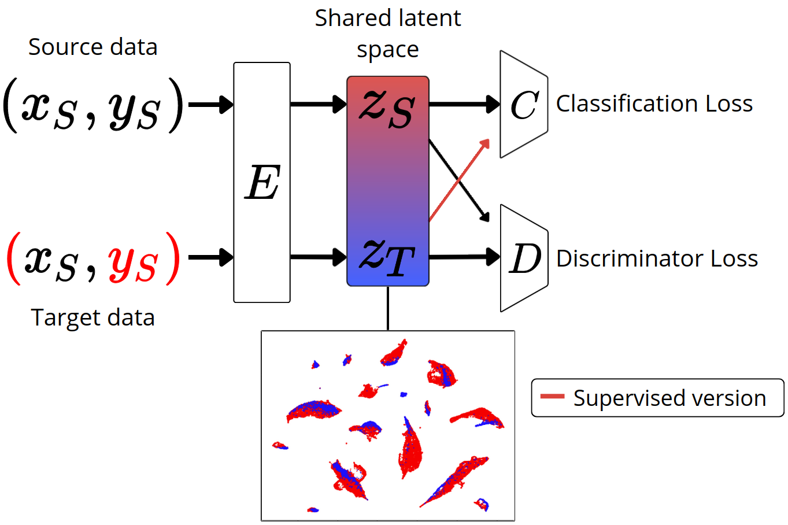

# Domain Adaptation for Knowledge Transfer Across RNA-Seq Datasets
This repository contains the code used for the experiments in the article "Adversarial Domain Adaptation Enables Knowledge Transfer Across RNA-Seq Datasets".<br>
The objective is to evaluate the application of Domain Adaptation on gene expression datasets through a deep learning-based framework. <br>

## Method


## Datasets
### The Cancer Genome Atlas (TCGA)
The Cancer Genome Atlas ([[TCGA]](https://portal.gdc.cancer.gov/)) collected many types of data for each of over 20,000 tumor and normal samples. Each step in the Genome Characterization Pipeline generated numerous data points, such as:
* clinical information (e.g., smoking status)
* molecular analyte metadata (e.g., sample portion weight)
* molecular characterization data (e.g., gene expression values)

### All RNA-Seq and ChIP-Seq Sample and Signature Search (ARCHS4)
ARCHS4 is a pan-tissue dataset containing samples originating from experiences from SRA and GEO. It is composed of diverse samples from experiences that do not only focus on cancer.

### Genotype Tissue Expression (GTEx)
GTEx is a large-scale resource that profiles gene expression across multiple human tissues. It contains RNA-Seq data from postmortem tissue samples collected from hundreds of donors.

## Installation
```
git clone git@github.com:kdradjat/da_rnaseq.git
cd da_rnaseq
python3 -m venv venv
source venv/bin/activate
pip install .
```
## Usage 
All the scripts used for the experiments with the differents methods are available on the [scripts](https://github.com/kdradjat/da_rnaseq/tree/main/scripts) folder.
